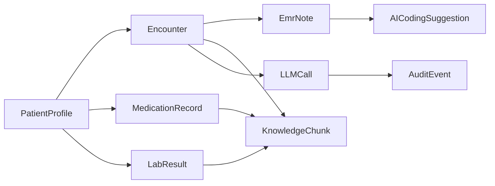

# Patient Data Table Design (MVP)

## Design Targets
- Support transcript-to-EMR generation with reliable patient context.
- Support ICD/CPT suggestion with auditable evidence.
- Keep schema minimal now, but extensible to richer workflows later.
- Reuse useful structure patterns from MediCareAI, especially layered backend and case-centric records from [models.py](/home/yuanji/Documents/project/MediCareAI/backend/app/models/models.py), API modularity from [api.py](/home/yuanji/Documents/project/MediCareAI/backend/app/api/api_v1/api.py), and AI service separation from [ai_service.py](/home/yuanji/Documents/project/MediCareAI/backend/app/services/ai_service.py).

## Architecture Boundaries
- **Patient Master Data**: stable demographics and chronic context.
- **Longitudinal Clinical Data**: encounters, medications, labs, diagnosis history.
- **AI Artifacts**: generated EMR, coding suggestions, evidence links, model logs.
- **RAG Knowledge Layer**: chunked and embedded sources for DualRAG routes (`patient`, `guideline`).
- **Coding Catalog Layer**: ICD/CPT catalogs are managed as structured code systems, not DualRAG primary routes.
- **Operations Layer**: LLM call logs, retrieval logs, and audit events for compliance and observability.



---

## Section 1: Patient Master & Demographics

### `patients` (master identity table)
- `id` UUID PK
- `external_patient_id` VARCHAR(64) UNIQUE — clinic MRN or external system ID
- `name_masked` VARCHAR(64) — display-safe masked form: `"J*** D***"`, derived from full name on write; never stores raw PII
- `sex_at_birth` VARCHAR(10)
- `date_of_birth` DATE
- `primary_language` VARCHAR(10) DEFAULT `'en-US'`
- `allergy_summary_json` JSONB — **denormalized cache only**, auto-synced from `allergy_records` on write; do not write directly
- `active_problem_summary_json` JSONB — denormalized cache for LLM context injection
- `consent_flags_json` JSONB
- `created_at` TIMESTAMPTZ, `updated_at` TIMESTAMPTZ

> **`allergy_summary_json` policy**: This column is a read-optimized cache auto-populated by the application layer whenever `allergy_records` is mutated. Source of truth is always `allergy_records`. Never write to `allergy_summary_json` directly from API handlers.

### `patient_demographics` (PHI isolation table)
- `id` UUID PK
- `patient_id` UUID FK → `patients.id` UNIQUE (1:1)
- `first_name` VARCHAR(64)
- `middle_initial` CHAR(1)
- `last_name` VARCHAR(64)
- `date_of_birth` DATE (redundant copy for PHI boundary; `patients.date_of_birth` is non-PHI year only if needed)
- `gender` VARCHAR(20)
- `race` VARCHAR(64)
- `ethnicity` VARCHAR(64)
- `marital_status` VARCHAR(20)
- `preferred_language` VARCHAR(10) DEFAULT `'en-US'`
- `mobile_phone_encrypted` TEXT
- `home_phone_encrypted` TEXT
- `email_encrypted` TEXT
- `street_address_encrypted` TEXT
- `apt` VARCHAR(16)
- `city` VARCHAR(64)
- `state` CHAR(2)
- `zip_code` VARCHAR(10)
- `country` CHAR(2) DEFAULT `'US'`
- `notification_preference` VARCHAR(20)
- `ssn_encrypted` TEXT — full SSN, AES-256-GCM encrypted, key from env/KMS; **never returned in API responses**
- `ssn_last4` CHAR(4) — for display and lookup only
- `created_at` TIMESTAMPTZ, `updated_at` TIMESTAMPTZ

> **SSN handling rules**:
> - `ssn_encrypted`: AES-256-GCM, key loaded from `ENCRYPTION_KEY` env var (base64-encoded 32 bytes). Encrypted value stored as `base64(iv + ciphertext + tag)`.
> - `ssn_last4`: plain text, used for all normal search/display flows.
> - Full SSN decryption requires privileged role + explicit `reason` field in request; every access must emit an `audit_event`.

---

## Section 2: Provider

### `providers`
- `id` UUID PK
- `external_provider_id` VARCHAR(64) UNIQUE — NPI or clinic system ID
- `first_name` VARCHAR(64)
- `last_name` VARCHAR(64)
- `full_name` VARCHAR(128) — derived display name (e.g. "Dr. Sarah Chen, MD"), kept for backward compat
- `gender` VARCHAR(16) NULLABLE — `male | female | nonbinary | undisclosed`
- `date_of_birth` DATE NULLABLE — optional, used for identity verification only; not surfaced in LLM prompts
- `credentials` VARCHAR(64) NULLABLE — professional degree(s): `MD`, `DO`, `NP`, `PA`, `MBBS`, etc.
- `specialty` VARCHAR(64) — primary specialty code, e.g. `pulmonology`
- `sub_specialty` VARCHAR(64) NULLABLE — e.g. `critical_care`, `interventional`, `general` — used for prompt template selection
- `department` VARCHAR(64)
- `license_number` VARCHAR(64) NULLABLE — state medical license (for documentation/audit)
- `license_state` VARCHAR(4) NULLABLE — two-letter state code (e.g. `CA`, `NY`)
- `prompt_style` VARCHAR(32) DEFAULT `'standard'` — hint for LLM prompt selection: `standard | detailed | concise | pediatric | critical_care`
- `is_active` BOOLEAN DEFAULT TRUE
- `created_at` TIMESTAMPTZ, `updated_at` TIMESTAMPTZ

**Provider → LLM Prompt 关联设计：**

在 `emr_service.py` 构建 prompt 时，通过 `encounter.provider_id` 查询 provider，然后根据以下字段定制：

| 字段 | 在 prompt 中的用途 |
|------|-------------------|
| `credentials` | 称呼语境："Dr. Chen, MD, a pulmonologist..." |
| `specialty` | 选择专科 SOAP 模板（呼吸科 vs 心内科强调不同主客观内容） |
| `sub_specialty` | 进一步细化：critical care 强调通气支持、GCS；general 强调门诊随访 |
| `prompt_style` | 控制输出详细程度：`detailed` 产出更长的 assessment/plan；`concise` 适合急诊快速记录 |

```python
# emr_service.py 中的 provider context 注入示例
def _build_provider_context(provider: Provider | None) -> str:
    if not provider:
        return ""
    parts = [f"{provider.full_name}"]
    if provider.credentials:
        parts.append(provider.credentials)
    if provider.specialty:
        parts.append(f"specialty: {provider.specialty}")
    if provider.sub_specialty:
        parts.append(f"sub-specialty: {provider.sub_specialty}")
    return ", ".join(parts)

# 注入到 EMR generation prompt:
# "You are assisting {provider_context}. Generate a SOAP note..."
```

> MVP: providers are read-only reference data. No auth integration in MVP scope.
> `date_of_birth` and `license_number` are stored but never surfaced in LLM prompt context (PHI minimization).
> `prompt_style` defaults to `standard`; can be overridden per provider in clinic configuration.

---

## Section 3: Longitudinal Clinical Data

### `encounters`
- `id` UUID PK
- `patient_id` UUID FK → `patients.id`
- `provider_id` UUID FK → `providers.id` NULLABLE
- `encounter_time` TIMESTAMPTZ
- `care_setting` VARCHAR(20) — `outpatient | inpatient | ed | telehealth`
- `department` VARCHAR(64)
- `transcript_text` TEXT
- `chief_complaint` TEXT
- `encounter_context` JSONB NULLABLE — optional structured context from intake (e.g., `{"reason_for_visit": "...", "referred_by": "..."}`)
- `status` VARCHAR(20) — `draft | in_progress | completed | cancelled`
- `created_at` TIMESTAMPTZ, `updated_at` TIMESTAMPTZ

### `emr_notes`
- `id` UUID PK
- `encounter_id` UUID FK → `encounters.id`
- `note_version` INT DEFAULT 1 — incremented on each regeneration; new row created, old rows retained (immutable history)
- `is_current` BOOLEAN DEFAULT TRUE — only one row per encounter should be TRUE
- `soap_json` JSONB — `{subjective, objective, assessment, plan}`
- `note_text` TEXT — plain-text rendering
- `is_final` BOOLEAN DEFAULT FALSE
- `generated_by_model` VARCHAR(128)
- `context_trace_json` JSONB — merged context snapshot and conflict flags used during generation
- `request_id` UUID — ties to `llm_calls.request_id`
- `created_at` TIMESTAMPTZ

> **Versioning policy**: Never UPDATE `emr_notes` rows. To create a new version, INSERT with incremented `note_version`, set `is_current=TRUE`, and set all previous rows for the same `encounter_id` to `is_current=FALSE` in a single transaction.

### `diagnosis_records`
- `id` UUID PK
- `encounter_id` UUID FK → `encounters.id`
- `diagnosis_text` TEXT
- `is_primary` BOOLEAN
- `clinical_status` VARCHAR(20) — `active | resolved | ruled_out`
- `onset_date` DATE NULLABLE
- `created_at` TIMESTAMPTZ

### `medication_records`
- `id` UUID PK
- `patient_id` UUID FK → `patients.id`
- `encounter_id` UUID FK → `encounters.id` NULLABLE
- `medication_name` VARCHAR(256)
- `dose` VARCHAR(64)
- `route` VARCHAR(64)
- `frequency` VARCHAR(64)
- `start_date` DATE
- `end_date` DATE NULLABLE
- `indication` TEXT
- `is_active` BOOLEAN DEFAULT TRUE
- `created_at` TIMESTAMPTZ

### `lab_reports`
- `id` UUID PK
- `patient_id` UUID FK → `patients.id`
- `encounter_id` UUID FK → `encounters.id` NULLABLE
- `report_time` TIMESTAMPTZ
- `report_source` VARCHAR(128)
- `report_text_raw` TEXT
- `file_uri` TEXT NULLABLE
- `created_at` TIMESTAMPTZ

### `lab_results`
- `id` UUID PK
- `lab_report_id` UUID FK → `lab_reports.id`
- `test_name` VARCHAR(256)
- `value_text` TEXT
- `value_num` NUMERIC NULLABLE
- `unit` VARCHAR(64)
- `reference_range` VARCHAR(128)
- `abnormal_flag` VARCHAR(10) — `normal | high | low | critical`
- `sample_time` TIMESTAMPTZ

### `allergy_records`
- `id` UUID PK
- `patient_id` UUID FK → `patients.id`
- `allergen` VARCHAR(256)
- `reaction` TEXT
- `severity` VARCHAR(20) — `mild | moderate | severe`
- `status` VARCHAR(20) — `active | inactive | entered_in_error`
- `recorded_at` TIMESTAMPTZ
- `created_at` TIMESTAMPTZ

> Source of truth for allergies. Application layer must refresh `patients.allergy_summary_json` after every write to this table.

---

## Section 4: Coding Catalog & Suggestions

### `icd_catalog`
- `id` UUID PK
- `code` VARCHAR(16) NOT NULL
- `title` TEXT
- `chapter` VARCHAR(128)
- `includes_json` JSONB
- `excludes_json` JSONB
- `coding_notes_json` JSONB
- `effective_from` DATE
- `effective_to` DATE NULLABLE
- `jurisdiction` CHAR(2) DEFAULT `'US'`
- `catalog_version` VARCHAR(16) — e.g., `'ICD-10-CM-2025'`
- UNIQUE(`code`, `catalog_version`)

### `cpt_catalog`
- `id` UUID PK
- `code` VARCHAR(16) NOT NULL
- `short_name` VARCHAR(256) — abbreviated display name (maps from `CPTName` in source CSV)
- `description` TEXT — full description text (maps from `CPTDesc` in source CSV; fallback to `CPTName` if empty)
- `category` VARCHAR(128)
- `avg_fee` NUMERIC(10,4) NULLABLE — average fee from source data; NULL if not available
- `rvu` NUMERIC(8,4) NULLABLE — relative value unit; NULL if not available or zero
- `modifier_rules_json` JSONB — populated in v2; NULL for MVP
- `bundling_rules_json` JSONB — populated in v2; NULL for MVP
- `effective_from` DATE
- `effective_to` DATE NULLABLE
- `jurisdiction` CHAR(2) DEFAULT `'US'`
- `catalog_version` VARCHAR(16) — e.g., `'CPT-2026-04'`
- UNIQUE(`code`, `catalog_version`)

> **Field mapping from `Ref_CPT_202604091710.csv`**: `CPTCode → code` (after `.strip()`), `CPTName → short_name`, `CPTDesc → description` (fallback to `CPTName` if empty), `AvgFee → avg_fee` (`"0.0000"` → NULL), `RVU → rvu` (`"0"` → NULL). Fields `ClinicID`, `DoctorID`, `SuperBill`, `Status` are PMS-specific, always 0, and are ignored on ingestion.

> **Data source policy (MVP)**:
> - ICD-10-CM: Use CMS public release files (free, annual). MVP uses `ICD-10-CM-2025` subset: respiratory chapter (J00–J99) only.
> - CPT: Use AMA CPT sample/education subset for MVP. Full CPT requires AMA license. Respiratory-relevant CPT codes (e.g., 94010–94799, E&M codes) to be confirmed before Task 7 starts.
> - Both catalogs require catalog ingestion pipeline with version tagging and rollback support.

### `coding_suggestions`
- `id` UUID PK
- `encounter_id` UUID FK → `encounters.id`
- `note_id` UUID FK → `emr_notes.id` — refers to the specific note version that generated this suggestion
- `code_system` VARCHAR(8) — `ICD | CPT`
- `suggested_code` VARCHAR(16)
- `catalog_version` VARCHAR(16) — snapshot of catalog version at generation time
- `rank` INT
- `confidence` FLOAT
- `rationale` TEXT
- `status` VARCHAR(20) DEFAULT `'needs_review'` — `suggested | needs_review | accepted | rejected`
- `reviewed_by` UUID NULLABLE — provider/admin user ID
- `reviewed_at` TIMESTAMPTZ NULLABLE
- `created_at` TIMESTAMPTZ

> **`needs_review` expiry policy**: Suggestions older than 72 hours without review are automatically flagged as `stale` via a scheduled job (out of MVP scope; add `stale` to status enum in v2).

### `coding_evidence_links`
- `id` UUID PK
- `coding_suggestion_id` UUID FK → `coding_suggestions.id`
- `source_namespace` VARCHAR(20) — `patient_rag | guideline_rag | rule_engine`
- `source_ref_id` UUID NULLABLE — FK to `knowledge_chunks.id` if from RAG
- `evidence_route` VARCHAR(20) — `patient_rag | guideline_rag`
- `snippet` TEXT
- `score` FLOAT
- `created_at` TIMESTAMPTZ

---

## Section 5: RAG Knowledge Layer

### `knowledge_documents`
- `id` UUID PK
- `source_namespace` VARCHAR(20) — `patient | guideline`
- `source_ref_id` UUID NULLABLE — FK to `patients.id` when `source_namespace=patient`; NULL for guideline docs
- `title` TEXT
- `version` VARCHAR(64)
- `effective_from` DATE NULLABLE
- `effective_to` DATE NULLABLE
- `jurisdiction` CHAR(2) DEFAULT `'US'`
- `created_at` TIMESTAMPTZ

### `knowledge_chunks`
- `id` UUID PK
- `document_id` UUID FK → `knowledge_documents.id`
- `patient_id` UUID FK → `patients.id` NULLABLE — **denormalized for fast PatientRAG filtering**; populated when `source_namespace=patient`, NULL for guideline chunks
- `chunk_index` INT
- `chunk_text` TEXT
- `embedding_vector` VECTOR(1024) — **Qwen text-embedding-v3 output dimension: 1024** (confirm with `text-embedding-v3` API; do not change without migration)
- `metadata_json` JSONB — e.g., `{"encounter_id": "...", "report_time": "...", "abnormal_flag": true}`
- `is_active` BOOLEAN DEFAULT TRUE
- `created_at` TIMESTAMPTZ

> **Embedding dimension lock**: Qwen `text-embedding-v3` default output is `1024` dimensions. This value is frozen for MVP. Any change requires a pgvector index rebuild migration. Confirm dimension with a live API call before running migration `001`.

> **PatientRAG filter strategy**: Use `knowledge_chunks.patient_id` directly for patient-scoped vector search (B-tree pre-filter + pgvector cosine similarity). Do NOT rely on JSON path queries through `metadata_json` for the primary filter — this will not use the index.

### `retrieval_logs`
- `id` UUID PK
- `encounter_id` UUID FK → `encounters.id`
- `request_id` UUID — ties to `llm_calls.request_id`
- `route` VARCHAR(20) — `patient_rag | guideline_rag`
- `query_text` TEXT
- `retrieved_chunk_ids_json` JSONB — array of chunk UUIDs
- `retrieval_scores_json` JSONB — parallel array of similarity scores
- `created_at` TIMESTAMPTZ

---

## Section 6: Operations & Observability

### `llm_calls`
- `id` UUID PK
- `request_id` UUID — shared across all nodes of a single EMR generation request
- `encounter_id` UUID FK → `encounters.id` NULLABLE
- `graph_node_name` VARCHAR(64) — LangGraph node that made the call (e.g., `emr_generation_node`, `icd_coding_node`)
- `route` VARCHAR(20) NULLABLE — `patient_rag | guideline_rag | None` for non-RAG nodes
- `model_name` VARCHAR(128)
- `prompt_tokens` INT
- `completion_tokens` INT
- `latency_ms` INT
- `response_status` VARCHAR(20) — `success | retry | failed`
- `error_message` TEXT NULLABLE
- `created_at` TIMESTAMPTZ

### `audit_events`
- `id` UUID PK
- `event_type` VARCHAR(64) — e.g., `ssn_full_access | note_finalized | coding_accepted | coding_rejected`
- `actor_id` VARCHAR(128) — user/service identity (API key ID or user UUID)
- `actor_role` VARCHAR(64)
- `patient_id` UUID NULLABLE — FK → `patients.id`
- `resource_type` VARCHAR(64) — e.g., `patient_demographics | emr_note | coding_suggestion`
- `resource_id` UUID NULLABLE
- `access_reason` TEXT NULLABLE — required for `ssn_full_access` events
- `request_id` UUID NULLABLE
- `ip_address` INET NULLABLE
- `created_at` TIMESTAMPTZ

> **Immutability policy**: `audit_events` is append-only. No UPDATE or DELETE is permitted by the application role. The DB role used by the application should have INSERT-only privilege on this table. For production, forward events to an external SIEM or append-only log store (out of MVP scope; add as v2 requirement).

---

## Section 7: Indexing & Performance

### B-tree indexes
```sql
-- Hot read paths
CREATE INDEX ON encounters(patient_id, encounter_time DESC);
CREATE INDEX ON medication_records(patient_id, is_active);
CREATE INDEX ON lab_reports(patient_id, report_time DESC);
CREATE INDEX ON lab_results(lab_report_id);
CREATE INDEX ON allergy_records(patient_id, status);
CREATE INDEX ON coding_suggestions(encounter_id, code_system, rank);
CREATE INDEX ON emr_notes(encounter_id, is_current);
-- PatientRAG fast pre-filter
CREATE INDEX ON knowledge_chunks(patient_id) WHERE patient_id IS NOT NULL;
CREATE INDEX ON knowledge_chunks(document_id, is_active);
-- Audit and observability
CREATE INDEX ON audit_events(patient_id, created_at DESC);
CREATE INDEX ON audit_events(event_type, created_at DESC);
CREATE INDEX ON llm_calls(request_id);
CREATE INDEX ON retrieval_logs(encounter_id);
```

### Vector index
```sql
-- pgvector IVFFlat (MVP-safe; switch to HNSW when chunk count > 100k)
CREATE INDEX ON knowledge_chunks
  USING ivfflat (embedding_vector vector_cosine_ops)
  WITH (lists = 100);
```

### Partition candidates (v2)
`retrieval_logs`, `llm_calls`, `audit_events` — partition by `created_at` (monthly) once volume requires it. Not in MVP.

---

## Section 8: Data Governance & Safety

- `patient_demographics` is the PHI boundary. Application DB role has no direct SELECT on this table except via a designated service function.
- `ssn_encrypted`: AES-256-GCM. Key source: `ENCRYPTION_KEY` env var. Key rotation procedure must be documented before go-live.
- `audit_events`: INSERT-only for application role; reviewed weekly in MVP.
- Every `coding_suggestion` created with `status='needs_review'`; human confirmation required before `accepted`.
- Every `emr_notes` row is immutable after creation; versioning via `note_version` + `is_current`.
- PII-safe logging: `ssn`, `phone`, `email`, `address` fields must be redacted in all application logs.
- English-only data contracts: `transcript_text`, `note_text`, `soap_json`, coding `rationale` must be `en-US` for all MVP endpoints.

---

## Section 9: Migration Sequence

1. `001_init`: Enable `pgvector` extension; create `patients`, `patient_demographics`, `providers`.
   - `providers` 表含完整字段：`first_name`, `last_name`, `full_name`, `gender`, `date_of_birth`, `credentials`, `specialty`, `sub_specialty`, `department`, `license_number`, `license_state`, `prompt_style`, `is_active`, `created_at`, `updated_at`.
2. `002_encounters`: Create `encounters`, `emr_notes`, `diagnosis_records`.
3. `003_longitudinal`: Create `medication_records`, `lab_reports`, `lab_results`, `allergy_records`.
4. `004_coding`: Create `icd_catalog`, `cpt_catalog`, `coding_suggestions`, `coding_evidence_links`.
5. `005_rag`: Create `knowledge_documents`, `knowledge_chunks` (with `VECTOR(1024)` column), `retrieval_logs`.
6. `006_ops`: Create `llm_calls`, `audit_events`.
7. `007_indexes`: Create all B-tree and vector indexes.

> Run migrations in sequence. Never skip. Each migration must be idempotent (use `IF NOT EXISTS`).

---

## Section 10: Minimal API Contracts (MVP)

| Method | Path | Description |
|--------|------|-------------|
| `POST` | `/v1/emr/generate` | Generate EMR from transcript |
| `POST` | `/v1/coding/icd/suggest` | Suggest ICD codes for encounter |
| `POST` | `/v1/coding/cpt/suggest` | Suggest CPT codes for encounter |
| `POST` | `/v1/rag/index` | Ingest document into knowledge layer |
| `GET`  | `/v1/encounters/{id}/report` | Retrieve full encounter report |
| `GET`  | `/v1/health` | Health check |
